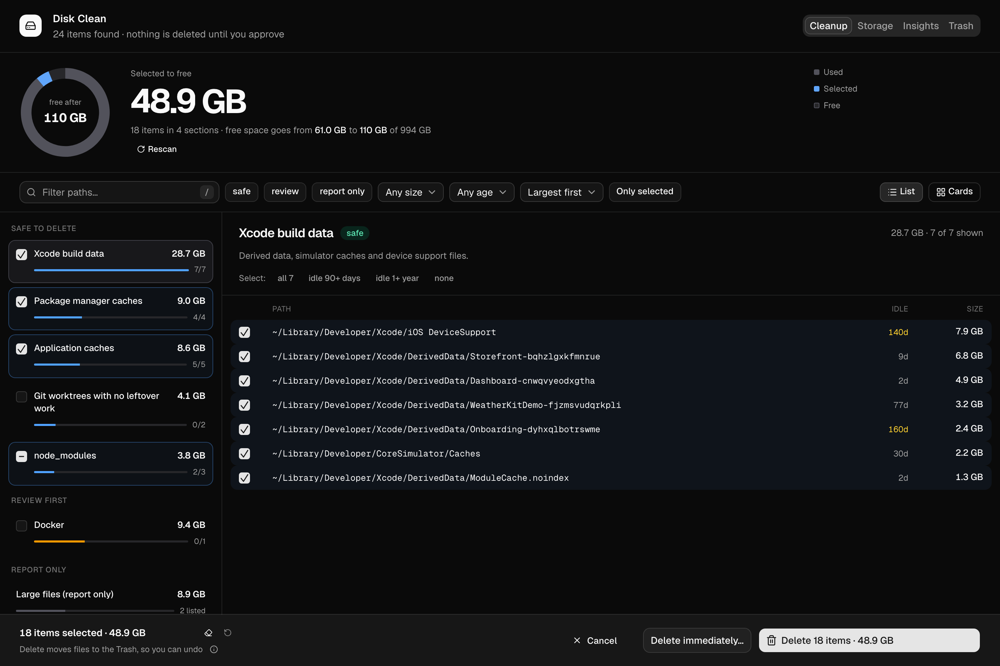
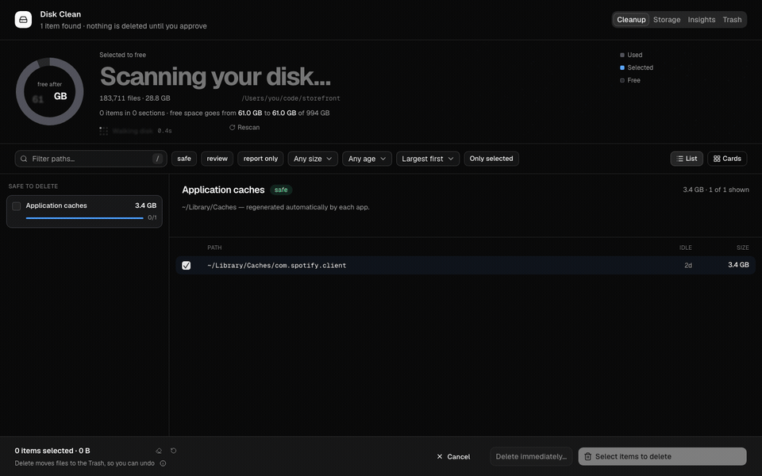
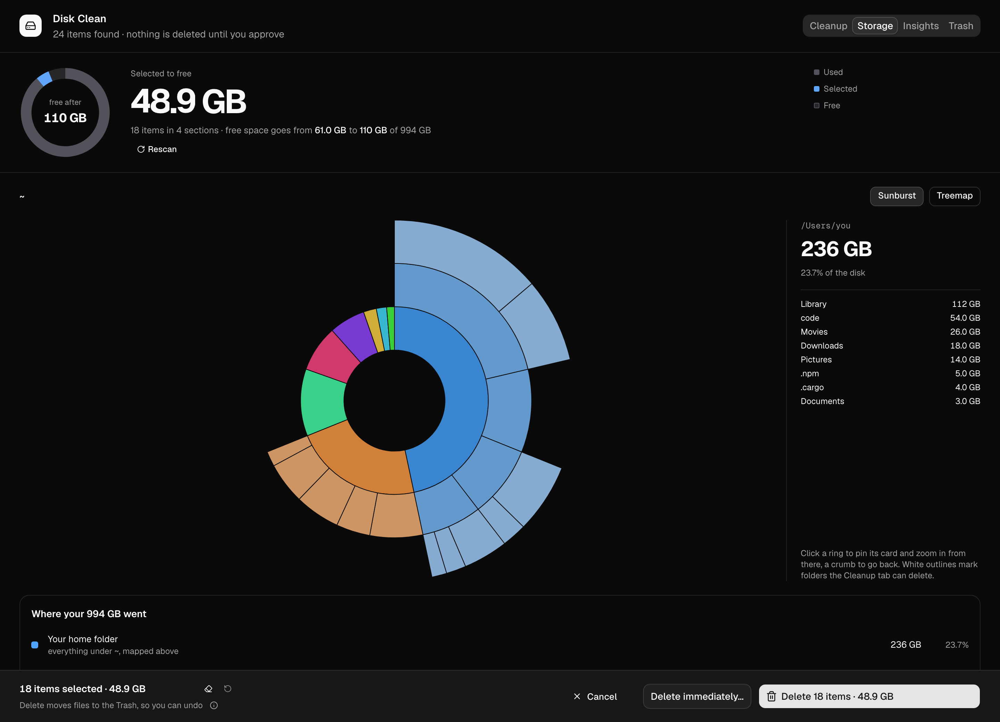
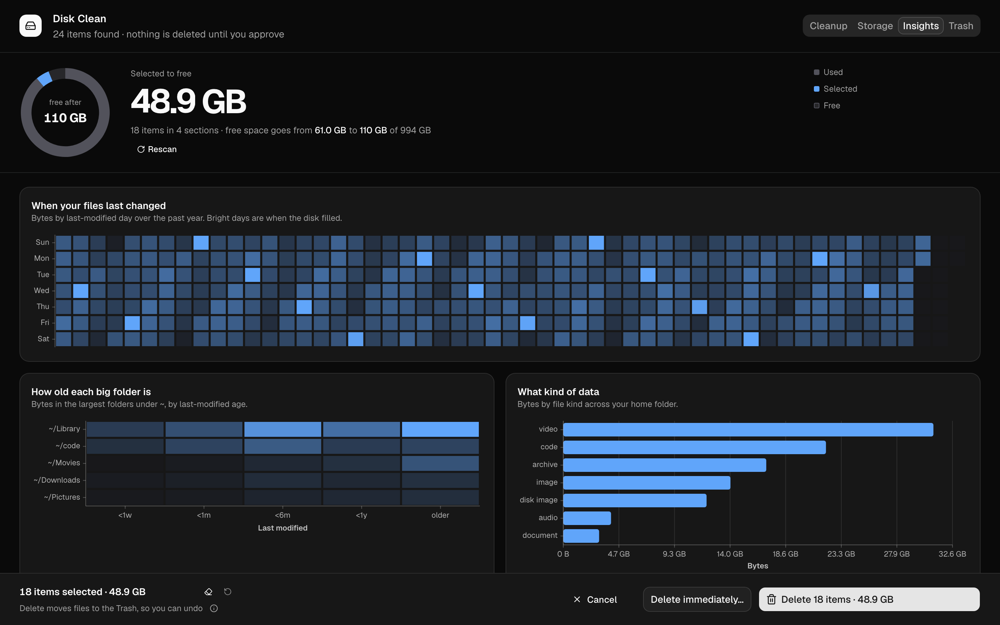
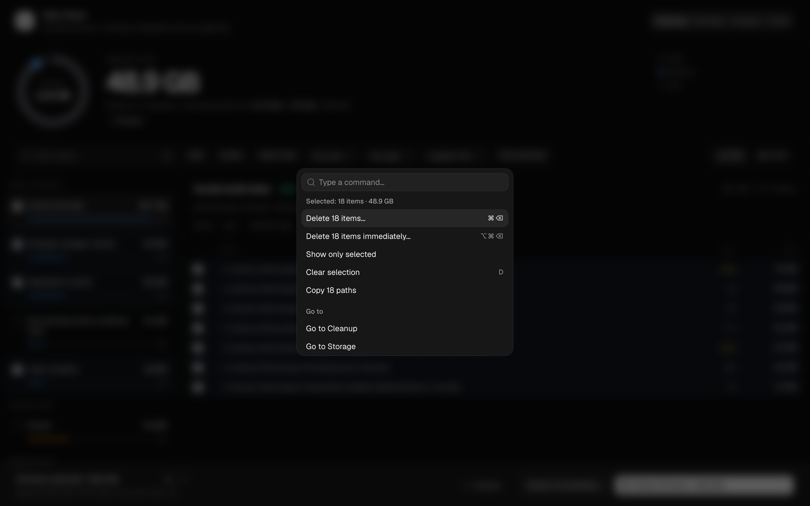
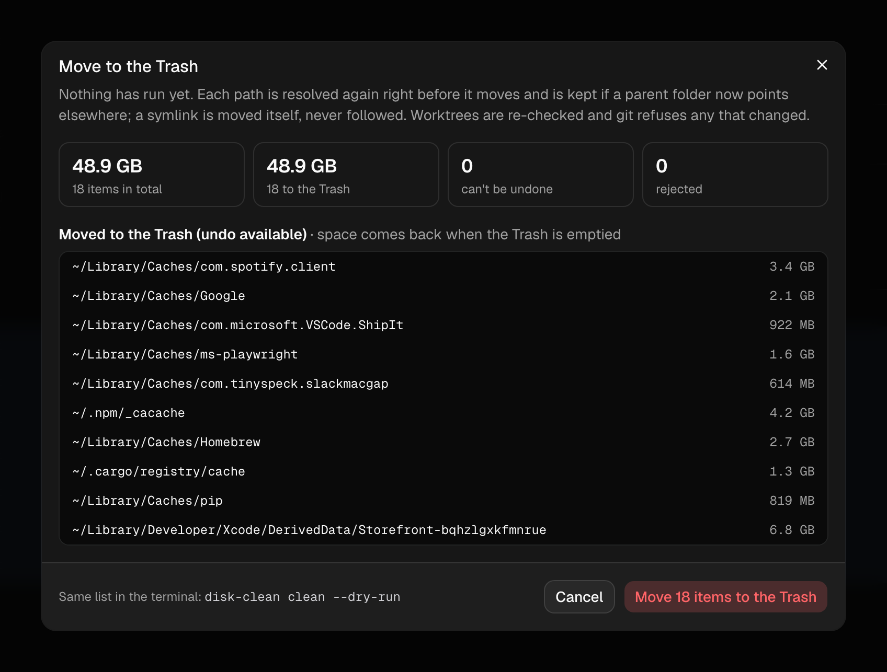
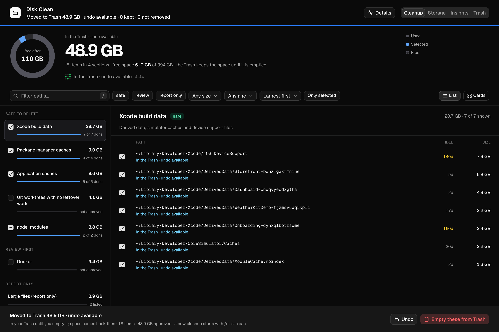

<div align="center">



<h1>🧹&nbsp; disk-clean</h1>

<p>
  <strong>Ask Claude to clean up your disk. Review every path in your browser. Delete only what you approve.</strong>
  <br>
  A <a href="https://code.claude.com">Claude Code</a> plugin for macOS, Linux and Windows. Approved items go to the Trash, so Undo works.
</p>

<p>
  <a href="#install"><strong>Install</strong></a>
  &nbsp;·&nbsp;
  <a href="#how-it-works"><strong>How it works</strong></a>
  &nbsp;·&nbsp;
  <a href="#safety"><strong>Safety</strong></a>
  &nbsp;·&nbsp;
  <a href="https://github.com/omridevk/mopper/releases"><strong>Releases</strong></a>
  &nbsp;·&nbsp;
  <a href="https://github.com/omridevk/mopper/issues"><strong>Report a bug</strong></a>
</p>

<p>
  <a href="https://github.com/omridevk/mopper/actions/workflows/ci.yml"></a>
  <a href="https://github.com/omridevk/mopper/releases"></a>
  <a href="./LICENSE"></a>
  
  
</p>



</div>

---

## What is it?

**disk-clean** finds reclaimable disk space: caches, logs, package-manager caches, Xcode data,
every `node_modules`, stale build output, temp folders, Docker, app code-signing clones, and git
worktrees with no leftover work. It opens a local review page that lists exactly what would be
deleted, and deletes only what you approve. Approved items go to the system Trash (the Recycle Bin
on Windows), so you can put them back.

This repo is **mopper**, a Claude Code plugin marketplace for keeping a disk in check. It has one
plugin: `disk-clean`.

## Install

In Claude Code:

```
/plugin marketplace add omridevk/mopper
/plugin install disk-clean@mopper
```

Or from a shell:

```bash
claude plugin marketplace add omridevk/mopper
claude plugin install disk-clean@mopper
```

Then ask Claude to "clean up my disk", or run `/disk-clean`.

Update with `claude plugin update disk-clean@mopper`.

Requirements: macOS, Linux or Windows, and `git`. Rust only if building from source.

## Features

- ⚡ &nbsp;**Live scan**: the review page opens as soon as the scan starts and fills in while it runs. Items already listed can be deleted before it finishes.
- ✅ &nbsp;**Nothing without your OK**: nothing is deleted until you confirm, and the confirm dialog lists every path, its size, and the exact commands that will run.
- ♻️ &nbsp;**Undo**: items go to the macOS Trash, the freedesktop.org Trash on Linux, or the Recycle Bin on Windows. Undo puts a whole cleanup back; Empty removes only disk-clean's items for good.
- 🗂️ &nbsp;**Sections by risk**: Safe, Review first and Report only, with search, risk, size and idle filters, sorting, a list or card view, and quick picks for "idle 90+ days" and "idle 1+ year".
- 🌳 &nbsp;**Git worktrees**: worktrees with no leftover work are offered for removal; the branch and every commit stay.
- 🍩 &nbsp;**Storage map**: a sunburst or treemap of the whole disk, so you also see the space it can't reclaim.
- 📊 &nbsp;**Insights**: when your files last changed, how old each big folder is, what kind of data you have, and your largest files.
- ⌨️ &nbsp;**Keyboard first**: a command palette on ⌘K / Ctrl+K, `?` for every shortcut, `/` to search, ⌘⌫ to delete.
- 🗑️ &nbsp;**Trash tab**: everything disk-clean moved to the Trash, across runs, with Undo or Empty per item, per cleanup or for a selection.
- 🎬 &nbsp;**Cleanup movie**: watch the cleanup as a short film, or open the live log of every move, removal and failure.
- 📏 &nbsp;**Honest sizes**: sizes the scan measured directly count toward the total; estimates such as Docker's VM disk are shown apart with a `≈`.

## How it works

**1. Scan.** Run `/disk-clean`. A single `disk-clean` binary walks the disk in the background and a
local page opens in your browser right away, filling in as items are found: the cleanup list, the
storage map and insights, then the git worktree checks and the Docker probe.

**2. Review.** Tick or untick anything. Sections are grouped by risk, and the recommended items are
already ticked. The Storage and Insights tabs show where the rest of the disk went.

<div align="center">
  
  <br><br>
  
  <br><br>
  
</div>

**3. Delete to the Trash.** Click **Delete**. The confirm dialog is built by the same validation
code the cleanup uses: what moves to the Trash, what can't be undone (worktree removals, fixed
commands) and anything the safety checks rejected. **Delete immediately…** skips the Trash and says
so first.

<div align="center">
  
</div>

**4. Undo.** The cleanup runs in the background and the page follows it live. When it is done,
**Undo** puts every item of that cleanup back exactly where it was, and **Empty these from Trash**
deletes only those items for good, after its own confirm.

<div align="center">
  
</div>

## Safety

- Only paths from that run's scan can be deleted.
- `Documents`, `Desktop`, `.ssh`, keychains and other personal folders are hard-blocked.
- There is no `sudo`, and nothing asks for administrator rights.
- Git worktrees are removed only with `git worktree remove` (never `--force`), and only after every
  check passes again right before removal:
  - a clean `git status`, including untracked files
  - no process running inside it
  - no merge or rebase in progress
  - no commits that exist only in that worktree
  - no ignored files except known build output
- The branch and all its commits always stay.
- Approved items go to the system Trash (the Recycle Bin on Windows), so Undo works until the Trash
  is emptied. Only **Delete immediately…**, which says "can't be undone" before it runs, skips it.

## Platforms

| Platform | Release binary |
| --- | --- |
| macOS | universal (arm64 + x86_64) |
| Linux | x86_64 and arm64, static (musl) |
| Windows | x86_64 and arm64 |

The skill runs a single `disk-clean` binary through `scripts/run.sh` (`scripts/run.ps1` on
Windows). On first use it downloads the release built for the installed plugin version from
[GitHub releases](https://github.com/omridevk/mopper/releases), checks its sha256, and caches it
in the plugin data folder. If no release exists for that version, it builds the bundled source
with `cargo build --release --locked` instead (needs [Rust](https://rustup.rs)).

## Development

The CLI source lives in `plugins/disk-clean/cli` (Rust 1.93, edition 2024).

```bash
cd plugins/disk-clean/cli
cargo fmt --check
cargo clippy --all-targets -- -D warnings
cargo test --locked
cargo run --release -- scan        # read-only; writes a run dir under ~/.cache/disk-clean
cd -
shellcheck plugins/disk-clean/skills/disk-clean/scripts/run.sh
claude plugin validate --strict .
claude plugin validate --strict ./plugins/disk-clean
```

The tests build every fixture in a temp folder. Deletion is only ever exercised there.

The review page is a React app in `plugins/disk-clean/web` (Vite, shadcn on Base UI, Tailwind,
TanStack Charts). `pnpm run build` there writes the single self-contained
`plugins/disk-clean/cli/assets/page.html` that the binary embeds; commit it with any web change
(CI fails when it is stale). Cargo builds never need Node.

```bash
pnpm install
cd plugins/disk-clean/web
pnpm test            # browser tests, headless Chromium
pnpm run build       # rebuilds cli/assets/page.html
pnpm dev             # needs dev/fixture.json: {"data": <review page data>, "token": "..."}
```

Set `DISK_CLEAN_REVIEW_URL` to a running `disk-clean review` server to proxy `/preview` and
`/decide` to it during `pnpm dev`.

The screenshots and demo GIF in `.github/assets` come from `pnpm run screenshots` in
`plugins/disk-clean/web`: headless Chromium on a built-in synthetic fixture, `ffmpeg` for the GIF,
`--gif-only` to skip the screenshots.

## Releasing

1. Bump `version` in `plugins/disk-clean/.claude-plugin/plugin.json` (and in `cli/Cargo.toml`).
   Installed copies only update when that string changes, and `run.sh` fetches the binary for it.
2. Tag with `claude plugin tag ./plugins/disk-clean` (creates `disk-clean--v<version>`) and push the tag.
3. The `release` workflow checks the tag matches `plugin.json`, builds an arm64 + x86_64 universal
   macOS binary, static musl Linux binaries for x86_64 and arm64, and Windows binaries with the
   static C runtime for x86_64 and arm64, and publishes `disk-clean-macos-universal.tar.gz`,
   `disk-clean-linux-x86_64.tar.gz`, `disk-clean-linux-arm64.tar.gz`,
   `disk-clean-windows-x86_64.zip` and `disk-clean-windows-arm64.zip`, each with its `.sha256`
   and a signed build provenance attestation. Crates are fetched through Socket Firewall Free, then built offline.

To verify a downloaded release came from this repo's workflow:

```bash
gh attestation verify disk-clean-macos-universal.tar.gz --repo omridevk/mopper
gh attestation verify disk-clean-linux-x86_64.tar.gz --repo omridevk/mopper
gh attestation verify disk-clean-linux-arm64.tar.gz --repo omridevk/mopper
gh attestation verify disk-clean-windows-x86_64.zip --repo omridevk/mopper
gh attestation verify disk-clean-windows-arm64.zip --repo omridevk/mopper
```

## License

[MIT](./LICENSE)
